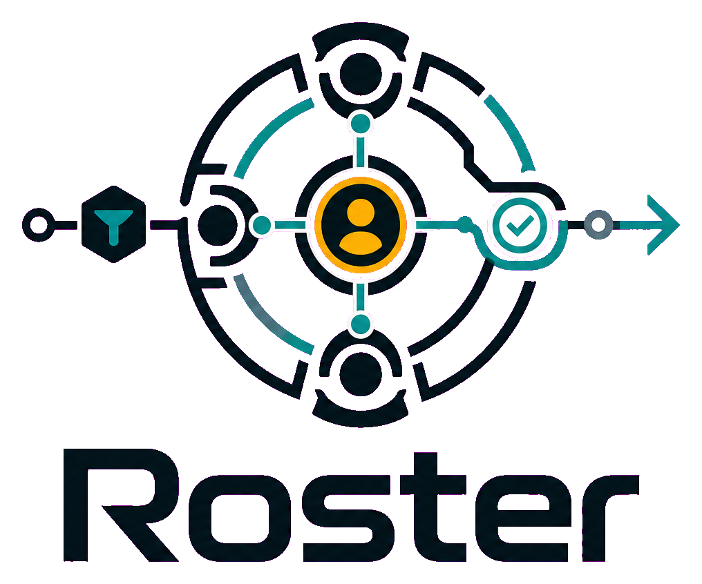

<p align="center">
  <picture>
    <source media="(prefers-color-scheme: dark)" srcset="assets/brand/roster-logo-dark-transparent.png" />
    
  </picture>
</p>

A pipeline framework for fast and correct software development with coordinated agent teams.

Three principles:

- **Platform constraint:** Claude Code and Codex do not support recursive agent spawning at runtime. Roster is designed around this: each skill invocation is a single-context operation, and multi-stage work requires the human to relay context between sessions. This is not a feature — it is an architectural reality we work within.
- **The team is the unit, not the agent.** Adding an agent means wiring it into the pipeline: patching the lead, updating adjacent agents, validating the integration.
- **Every plan needs a human who understood it.** A structured quiz runs before any execution batch begins. Passive approval is not validation.

## Install

One line. Works in any project, auto-detects your runtime:

```bash
curl -fsSL https://raw.githubusercontent.com/mathiasbourgoin/roster/main/scripts/install.sh | bash
```

Detects and installs for all present runtimes simultaneously:

| Runtime | Detected by | Recruiter target | Notes |
|---------|-------------|-----------------|-------|
| Claude Code | `.claude/` | `.claude/agents/recruiter.md` + `.claude/commands/recruit.md` | |
| OpenCode | `.opencode/` | `.opencode/agents/recruiter.md` | |
| Codex (project) | `.agents/` | `.agents/skills/recruit/SKILL.md` | |
| Codex (global) | `~/.codex/skills/` | `~/.codex/skills/recruit/SKILL.md` | |
| Pi | `.pi/` | `.pi/skills/recruit/SKILL.md` | ⚠️ untested |

**Options:**

```bash
# Install for all runtimes (creates dirs)
curl -fsSL .../install.sh | bash -s -- --all

# Explicit runtimes
curl -fsSL .../install.sh | bash -s -- --runtime claude,opencode

# Team mode: appends one-liner to AGENTS.md so teammates get it automatically
curl -fsSL .../install.sh | bash -s -- --team
```

After install: run `/recruit` (Claude / OpenCode) or `$recruit` (Codex) to assemble your team.

## The Pipeline

Roster ships as a set of slash-command skills. `/roster-run` is the entry point — it detects context and routes to the right phase automatically.

| Skill | Phase | What it does |
|-------|-------|--------------|
| `/roster-run` | Entry point | Detects context, routes to right phase |
| `/roster-init` | Bootstrap | Adversarial project interview — 6 questions, 3 adversarial |
| `/roster-question` | Question | Decomposes task into neutral research questions |
| `/roster-research` | Research | Blind documentarian research — file:line grounded, optional online scan |
| `/roster-intake` | Intake | Turns a task into a contractual brief with human gate |
| `/roster-spec` | Spec | Adversarial spec phase: user stories + challenges + runnable AC checks |
| `/roster-plan` | Plan | Dual-voice decomposition (two adversarial sub-agents), consensus |
| `/roster-implement` | Implement | TDD + improvement loop + specialist sub-agents |
| `/roster-review` | Review | Fix-first review, GO/NO-GO JSON verdict |
| `/roster-qa` | QA | Deterministic quality gates, gated on review GO |
| `/roster-ship` | Ship | Rebase-merge, conventional commits, PR |
| `/roster-investigate` | Operational | Root-cause analysis, read-only, freeze scope |
| `/roster-audit` | Operational | Code quality + spec compliance combined report |
| `/roster-skill-health` | Meta | Friction log analysis → proposes new skills, tools, adaptations |
| `/roster-skill-evolve` | Meta | Implements approved skill-health proposals |

### The spec phase

`/roster-spec` is auto-triggered for `feature` and `api-change` tasks. It runs a multi-sub-agent adversarial mini-pipeline before any implementation begins:

1. **Research sub-agent** — blind codebase survey (existing patterns, adjacent tests, entity conflicts)
2. **Story generation** — ≥2 independent user stories, each with priority, "why", and an independent test description; bounces if not achievable
3. **Challenge sub-agent** — adversarial agent finds ≥1 challenge per story (gaps, contradictions, missing constraints)
4. **Resolution loop** — challenges resolved from code/KB or escalated to the user (max 5 questions)
5. **Cross-spec consistency** — entity names grepped across `specs/*.md` to catch definition conflicts
6. **Artifact write** — `specs/<slug>.md` (permanent, indexed) + `briefs/<task>-spec.md` (pipeline marker)

Produced `specs/<slug>.md` files are indexed as `component_type: "spec"` and consumed by the architect, reviewer, and QA agents throughout the rest of the pipeline. A spec-level failure in review routes back to `/roster-spec`, not `/roster-implement`.

## Metabolism

The two things that make roster compound over time — rather than stay static like a prompt library.

### Skill metabolism

Every pipeline skill logs structured friction events to `skills-meta/friction.jsonl` (gitignored, local to each project):

```jsonl
{"date":"...","skill":"roster-plan","frictions":["decomp took 3 rounds"],"suggestion_type":"SKILL","suggestion":"roster-decomp-validator"}
```

Run `/roster-skill-health` manually after every 5–10 pipeline cycles (or when the friction count reminder fires at the end of `/roster-ship`). It clusters patterns and proposes concrete improvements:

- `[SKILL]` — a recurring workflow deserves its own reusable skill
- `[TOOL]` — a deterministic check should replace an LLM step (e.g. a custom linter)
- `[ADAPT]` — a tunable should change for this project's specific patterns
- `[AGENT]` — a new specialist agent is warranted

`/roster-skill-evolve` implements approved proposals. After ≥2 proposals are approved, run `/improvement-loop-planner` to convert them into bounded improvement loops with measurable success signals and iteration budgets.

### Agent metabolism

The **recruiter** is not a one-time setup tool. It:

- Searches roster + 6 external agent registries (`VoltAgent/awesome-claude-code-subagents`, `wshobson/agents`, and others) scored against your project's actual needs
- Proposes the minimal team that covers the task surface — no bloat
- Runs `/recruit update` to compare installed agent versions against the registry and propose upgrades
- Creates new agents from scratch (**Mode 4**) when no existing agent fits — invoke with `/recruit create <description>`, e.g. `/recruit create "an agent that reviews OpenAPI specs for REST conventions"`

The combination — a pipeline that logs its own friction + a recruiter that continuously rebalances the team — is what separates roster from a static prompt collection.

## Quick Start

```
/recruit
```

The recruiter assembles a minimal team and configures the harness. Default team (covers 80% of tasks):

| Agent | Role |
|-------|------|
| tech-lead | Orchestration, Ralph Loop, human gates |
| implementer | Code execution in isolated worktrees |
| reviewer | Structured review: correctness, security, regression |
| qa | Independent test verification |

Then run `/roster-run <task description>` to start the pipeline on any task.

## Harness Model

The canonical project harness lives under `.harness/` and is projected into runtime-specific surfaces:

```text
project/
├── .harness/          ← canonical source of truth
│   ├── agents/
│   ├── skills/
│   ├── rules/
│   ├── hooks/
│   │   ├── safety/          ← tool-level hooks (PreToolUse/PostToolUse)
│   │   ├── quality/
│   │   ├── skills/          ← skill-level hooks (pre/post per skill)
│   │   └── shared/          ← shared hook fragments (build-time inlined)
│   └── harness.json
├── .claude/           ← generated Claude projection
│   ├── agents/
│   ├── commands/
│   └── rules/
├── .agents/skills/    ← generated Codex projection
└── AGENTS.md
```

Bootstrap: `./scripts/init-harness.sh /path/to/project [profile]`  
Re-project after edits: `./scripts/sync-harness.sh /path/to/project`

Profiles: `core` · `developer` · `security` · `full`

Roster's own harness (`.harness/harness.json`) uses the `developer` profile — a live reference for what a minimal, working harness looks like.

## In Production

Roster was built while developing [octez-manager](https://github.com/tezos/octez-manager), a production OCaml project. The pipeline has been used for:
- Spec-driven feature development with the adversarial spec phase catching requirement gaps before implementation
- Multi-runtime agent harness management across Claude Code and OpenCode
- Iterative self-improvement via the friction log → skill-health → skill-evolve loop

This project is the distillation of what worked.

## Development

To add or update components:

1. Create the file in `agents/`, `skills/`, `rules/`, or `hooks/` following the relevant `schema/`
2. `npm run build:index`
3. Update `AGENTS.md`
4. Open a PR (rebase-merge only, conventional commits)

`specs/` contains sample pipeline spec outputs (produced by `/roster-spec`) — useful as reference examples of what a complete spec looks like.

**Version numbers:** `package.json` tracks the npm build tooling (`1.x`). The recruiter skill has its own independent version (`2.x`) declared in `recruiter/recruiter.md` frontmatter and mirrored in the `VERSION` file at repo root. These are separate semver tracks.

`index.json` is the published component index (tracked, ~1.3 MB). Run `npm run build:index` when adding or updating components; commit the updated file in the same PR. Only rebuild on actual component changes — not on every edit.

### Language Patterns

`patterns/` contains curated good/antipattern guides per language (TypeScript, Go, Python, Rust, OCaml, prompt engineering). These are reference material consumed by language-specific agents (implementer, ocaml-implementer) and injected as context during implementation phases — not standalone skills.


→ **[Full agent and skill catalog](docs/agents.md)**  
→ **[Skill Overlap Guide](docs/skill-overlap.md)** — when to use each audit/spec/research skill  
→ **[Skill hooks DSL and tutorial](docs/hooks.md)**  
→ **[Changelog](CHANGES.md)**
